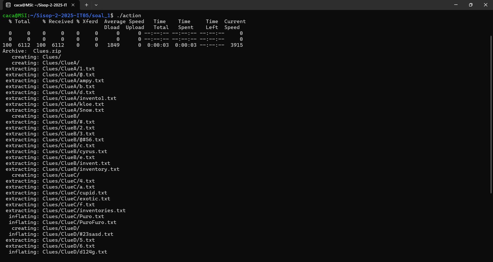
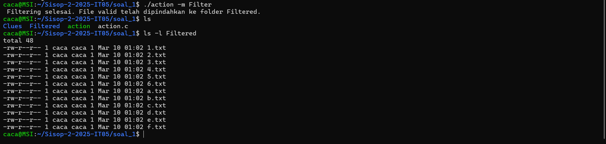
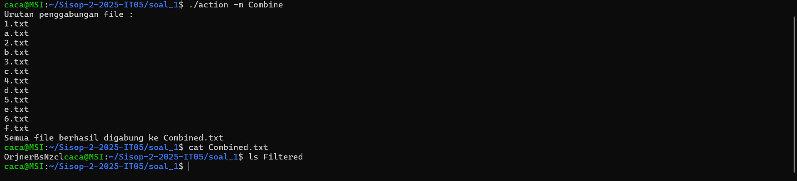
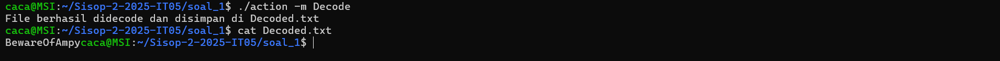

# Sisop-2-2025-IT05

below is the template

# Soal_1

Library:
```#include <stdio.h>
#include <stdlib.h>
#include <unistd.h>
#include <sys/wait.h>
#include <sys/stat.h>
#include <string.h>
#include <dirent.h>
#include <ctype.h>
```
this is the c code library for soal_1

## Sub Soal a

Command: 
```bash 
./action
```


Code:
```bash
void setupClues() {
    
    struct stat st = {0};
    if (stat("Clues", &st) == -1) {

        pid_t child1 = fork();
        if (child1 == 0) {
            execlp("curl", "curl", "-L", "-o", "Clues.zip",
                   "https://drive.usercontent.google.com/u/0/uc?id=1xFn1OBJUuSdnApDseEczKhtNzyGekauK&export=download",
                   NULL);
            exit(EXIT_FAILURE);
        }
        wait(NULL);

        pid_t child2 = fork();
        if (child2 == 0) {
            execlp("unzip", "unzip", "-o", "Clues.zip", NULL); 
            exit(EXIT_FAILURE);
        }
        wait(NULL);

        pid_t child3 = fork();
        if (child3 == 0) {
            execlp("rm", "rm", "Clues.zip", NULL);
            exit(EXIT_FAILURE);
        }
        wait(NULL);
    }
}
```
#### Explanation:
Checks if the directory "Clues" already exists.
If not, it automatically downloads a zip file named Clues.zip using curl,
extracts it using the unzip command, and removes the zip file afterward.
These actions are done by forking child processes and using exec to execute external commands.
This ensures the initial required data is prepared before any further tasks run.

Output: 



## Sub Soal b

Command:
```bash 
./action -m Filter
```


Code:
```bash
int isValidFileName(const char *filename) {
    char name[256];
    strncpy(name, filename, sizeof(name) - 1);
    name[sizeof(name) - 1] = '\0';

    char *dot = strchr(name, '.');
    if (dot) *dot = '\0';

    return strlen(name) == 1 && isalnum(name[0]);
}
```
#### Explanation:
Checks if the file name (excluding extension) is exactly one character long and is either a digit or a letter.
This function is used during the filtering process to validate which files are kept or deleted.


```bash
void filterFiles(const char *sourceFolder) {
    DIR *dir = opendir(sourceFolder);
    if (!dir) {
        perror("opendir");
        return;
    }

    struct stat st = {0};
    if (stat("Filtered", &st) == -1 && mkdir("Filtered", 0777) == -1) {
        perror("mkdir");
        closedir(dir);
        return;
    }

    struct dirent *entry;
    while ((entry = readdir(dir)) != NULL) {
        if (entry->d_name[0] == '.') continue;

        char path[MAX_PATH];
        snprintf(path, sizeof(path), "%s/%s", sourceFolder, entry->d_name);

        if (entry->d_type == DT_DIR) {
            filterFiles(path);
        } else if (entry->d_type == DT_REG || entry->d_type == DT_UNKNOWN) {
            if (isValidFileName(entry->d_name)) {
                char dest[MAX_PATH];
                snprintf(dest, sizeof(dest), "Filtered/%s", entry->d_name);
                if (rename(path, dest) != 0) perror("rename");
            } else {
                if (remove(path) != 0) perror("remove");
            }
        }
    }

    closedir(dir);
}
```
#### Explanation:
This function recursively traverses the "Clues" folder to find all regular files.
If a file passes the validation criteria (1-character alphanumeric name),
it is copied to a new "Filtered" folder using fork + exec (cp).
Invalid files (non-matching names) are deleted using fork + exec (rm).
The goal is to clean the dataset and keep only useful clue files.

Output: 




### Sub Soal c
Command:
```bash
./action -m Combine
```

```bash
int cmpstr(const void *a, const void *b) {
    return strcmp(*(char **)a, *(char **)b);
}

```
#### Explanation:
Used in qsort() to sort an array of file names in ascending (alphabetical) order.
This ensures consistent ordering when combining files in the next step.


Code:
```bash
void combineFiles(const char *folderPath) {
    DIR *dir = opendir(folderPath);
    if (!dir) {
        perror("Tidak bisa membuka folder");
        return;
    }

    char *angka[100], *huruf[100];
    int na = 0, nh = 0;

    struct dirent *e;
    while ((e = readdir(dir)) != NULL) {
        if (e->d_type == DT_REG && strstr(e->d_name, ".txt")) {
            if (isdigit(e->d_name[0])) angka[na++] = strdup(e->d_name);
            else if (isalpha(e->d_name[0])) huruf[nh++] = strdup(e->d_name);
        }
    }
    closedir(dir);

    qsort(angka, na, sizeof(char *), cmpstr);
    qsort(huruf, nh, sizeof(char *), cmpstr);

    printf("Urutan penggabungan file :\n");
    for (int i = 0; i < na || i < nh; i++) {
        if (i < na) printf("%s\n", angka[i]);
        if (i < nh) printf("%s\n", huruf[i]);
    }

    FILE *out = fopen("Combined.txt", "w");
    if (!out) {
        perror("Gagal membuka Combined.txt");
        return;
    }
```
#### Explanation:
Task C: This part merges the content of all filtered clue files into one output file: Combined.txt.
It separates files into two groups: those starting with digits and those starting with letters.


```bash
for (int i = 0; i < na || i < nh; i++) {
        char *files[2] = { i < na ? angka[i] : NULL, i < nh ? huruf[i] : NULL };

        for (int j = 0; j < 2; j++) {
            if (!files[j]) continue;

            char path[512], buffer[1024];
            snprintf(path, sizeof(path), "%s/%s", folderPath, files[j]);
            FILE *f = fopen(path, "r");

            if (f) {
                while (fgets(buffer, sizeof(buffer), f))
                    fputs(buffer, out);
                fclose(f);
                remove(path);
            }

            free(files[j]);
        }
    }

    fclose(out);
    puts("Semua file berhasil digabung ke Combined.txt");
}
```
#### Explanation:
Then it writes them into the combined file in alternating order (number-letter-number...).
If one group is larger, the remaining files are written at the end in sorted order.

Output: 




## Sub Soal d

Command :
```bash
./action -m Decode
```


Code:
```bash
void decodeRot13(const char *inputFile, const char *outputFile) {
    FILE *input = fopen(inputFile, "r");
    if (!input) {
        perror("Gagal membuka Combined.txt untuk membaca");
        return;
    }

    FILE *output = fopen(outputFile, "w");
    if (!output) {
        perror("Gagal membuka Decoded.txt untuk menulis");
        fclose(input);
        return;
    }

    char ch;
    while ((ch = fgetc(input)) != EOF) {
        if ((ch >= 'a' && ch <= 'z')) {
            ch = ((ch - 'a' + 13) % 26) + 'a';
        } else if ((ch >= 'A' && ch <= 'Z')) {
            ch = ((ch - 'A' + 13) % 26) + 'A';
        }
        fputc(ch, output);
    }

    fclose(input);
    fclose(output);
    printf("File berhasil didecode dan disimpan di Decoded.txt\n");
}
```
#### Explanation:
Applies the ROT13 cipher to each character in Combined.txt and writes the result into Decoded.txt.
ROT13 shifts alphabet characters by 13 positions (A ↔ N, B ↔ O, etc.).
This is used to reveal the original content of the clues.

Output: 




### Main Function 
```bash
int main(int argc, char *argv[]) {
    if (argc == 1) {
        setupClues();
        return 0;
    }

    if (argc == 3 && strcmp(argv[1], "-m") == 0) {
        if (strcmp(argv[2], "Filter") == 0) {
            filterFiles("Clues");
            printf(" Filtering selesai. File valid telah dipindahkan ke folder Filtered.\n");
            return 0;
        } else if (strcmp(argv[2], "Combine") == 0) {
            combineFiles("Filtered");
            return 0;
        } else if (strcmp(argv[2], "Decode") == 0) {
            decodeRot13("Combined.txt", "Decoded.txt");
            return 0;
        } else {
            fprintf(stderr, "Error.\n");
        }
    } else {
        fprintf(stderr, " Error: Invalid Argument.\n");
    }

    //Error Handling
    printf("Please Use:\n");
    printf("  ./program\n");
    printf("  ./program -m Filter\n");
    printf("  ./program -m Combine\n");
    printf("  ./program -m Decode\n");
    return 1;
}
```
#### Explanation:
Acts as the entry point of the program and handles user input arguments.
If no argument is given, it runs the default setup process (download and unzip).
If specific arguments are passed:
- "Filter": triggers the filtering process (Task B)
- "Combine": merges valid files into a single file (Task C)
- "Decode": decrypts the combined file using ROT13.
If the argument doesn't match any known option, it prints usage instructions. (Error Handling)


# Soal_2

```bash
#include <stdio.h>
#include <stdlib.h>
#include <sys/types.h>
#include <sys/wait.h>
#include <unistd.h>
#include <string.h>
#include <dirent.h>
#include <sys/stat.h>
#include <signal.h>
#include <time.h>
#include <ctype.h>
#include <errno.h>
```
this is the c code library for soal_2

```bash

#define SIZE 4096
pid_t decrypt_pid = -1;
```
#### Explanation:
Defines SIZE as 4096 for buffer size and declares a global PID for the decrypt daemon process


## Sub Soal a

Command: 
```bash
 ./starterkit
```

Code:
```bash
void setup() {
    pid_t child1, child2, child3;

    mkdir("starter_kit", 0777);

    child1 = fork();
    if (child1 == 0) {
        execlp("curl", "curl", "-L", "-o", "starter_kit.zip",
               "https://drive.usercontent.google.com/u/0/uc?id=1_5GxIGfQr3mNKuavJbte_AoRkEQLXSKS&export=download", NULL);
        exit(EXIT_FAILURE);
    }
    wait(NULL);

    child2 = fork();
    if (child2 == 0) {
        execlp("unzip", "unzip", "-o", "starter_kit.zip", "-d", "starter_kit", NULL);
        exit(EXIT_FAILURE);
    }
    wait(NULL);

    child3 = fork();
    if (child3 == 0) {
        execlp("rm", "rm", "starter_kit.zip", NULL);
        exit(EXIT_FAILURE);
    }
    wait(NULL);
}
```
#### Explanation:
Automatically executed if no arguments are passed.
Downloads the starter_kit.zip using curl.
Extracts the contents into a 'starter_kit' folder using unzip.
Deletes the zip file afterwards.

Output: 


### Sub Soal b

Command :
```bash
./starterkit --decrypt
```

Code:
```bash
int is_base64(const char *str) {
    int len = strlen(str); 
    if (len % 4 != 0) return 0; 

    for (int i = 0; i < len; i++) {
        char c = str[i];
        
        if (!((c >= 'A' && c <= 'Z') || 
              (c >= 'a' && c <= 'z') || 
              (c >= '0' && c <= '9') || 
              c == '+' ||               
              c == '/' ||               
              c == '='))                
            return 0;
    }
    return 1; 
}
```
#### Explanation:
checks if the file name is base64


Code:
```bash
void decrypt() {
    pid_t pid, sid;
    pid = fork();

    if (pid < 0) exit(EXIT_FAILURE);
    if (pid > 0) {
        FILE *pidFile = fopen("decrypt.pid", "w");
        if (pidFile != NULL) {
            fprintf(pidFile, "%d", pid);
            fclose(pidFile);
        }
        exit(EXIT_SUCCESS);
    }

    umask(0);
    sid = setsid();
    if (sid < 0) exit(EXIT_FAILURE);
    if ((chdir(".")) < 0) exit(EXIT_FAILURE);

    mkdir("quarantine", 0777);

    while (1) {
        DIR *dir;
        struct dirent *entry;

        //Cek di starter_kit → pindah & decrypt
        dir = opendir("starter_kit");
        if (dir != NULL) {
            while ((entry = readdir(dir)) != NULL) {
                if (entry->d_type == DT_REG && is_base64(entry->d_name)) {
                    char src_path[SIZE], dst_path[SIZE], decoded[SIZE];

                    snprintf(src_path, sizeof(src_path), "starter_kit/%s", entry->d_name);

                    // Decode base64
                    FILE *fp;
                    char cmd[SIZE];
                    snprintf(cmd, sizeof(cmd), "echo %s | base64 -d", entry->d_name);
                    fp = popen(cmd, "r");
                    if (fp == NULL) continue;
                    fgets(decoded, sizeof(decoded), fp);
                    decoded[strcspn(decoded, "\n")] = '\0';
                    pclose(fp);

                    // Pindah dan rename langsung ke quarantine
                    snprintf(dst_path, sizeof(dst_path), "quarantine/%s", decoded);
                    rename(src_path, dst_path);
                }
            }
            closedir(dir);
        }
        //Cek di quarantine → decrypt jika masih base64
        dir = opendir("quarantine");
        if (dir != NULL) {
            while ((entry = readdir(dir)) != NULL) {
                if (entry->d_type == DT_REG && is_base64(entry->d_name)) {
                    char oldpath[SIZE], newname[SIZE], newpath[SIZE];

                    snprintf(oldpath, sizeof(oldpath), "quarantine/%s", entry->d_name);

                    // Decode base64
                    FILE *fp;
                    char cmd[SIZE];
                    snprintf(cmd, sizeof(cmd), "echo %s | base64 -d", entry->d_name);
                    fp = popen(cmd, "r");
                    if (fp == NULL) continue;
                    fgets(newname, sizeof(newname), fp);
                    newname[strcspn(newname, "\n")] = '\0';
                    pclose(fp);

                    snprintf(newpath, sizeof(newpath), "quarantine/%s", newname);
                    rename(oldpath, newpath);
                }
            }
            closedir(dir);
        }

        sleep(5);
    }
}
```

#### Explanation:
Runs as a daemon in the background.
Periodically (every 5 seconds):
Scans starter_kit/ for Base64-encoded filenames, decodes them, and moves them to quarantine/ with decoded names.
Re-checks quarantine/ for any missed Base64 names and renames them properly.
Creates and writes the daemon PID to decrypt.pid for later reference (--shutdown).

Output: 


### Sub Soal c

Command :
```bash
./starterkit --quarantine
```


Code:
```bash 
void quarantineFiles() {
    DIR *dir = opendir("starter_kit");
    struct dirent *entry;

    if (dir == NULL) return;

    while ((entry = readdir(dir)) != NULL) {
        if (entry->d_type == DT_REG) {
            char oldpath[SIZE], newpath[SIZE], buffer[SIZE];
            snprintf(oldpath, sizeof(oldpath), "starter_kit/%s", entry->d_name);
            snprintf(newpath, sizeof(newpath), "quarantine/%s", entry->d_name);
            rename(oldpath, newpath);

            snprintf(buffer, sizeof(buffer), "%s - Successfully moved to quarantine directory.", entry->d_name);
            Log(buffer);
        }
    }
    closedir(dir);
}

```
#### Explanation:
Moves all regular files from starter_kit/ to quarantine/.
Logs the file move operation into activity.log.

Output: 


Command :
```bash
./starterkit --return
```


Code:
```bash
void returnFiles() {
    DIR *dir = opendir("quarantine");
    struct dirent *entry;

    if (dir == NULL) return;

    while ((entry = readdir(dir)) != NULL) {
        if (entry->d_type == DT_REG) {
            char oldpath[SIZE], newpath[SIZE], buffer[SIZE];
            snprintf(oldpath, sizeof(oldpath), "quarantine/%s", entry->d_name);
            snprintf(newpath, sizeof(newpath), "starter_kit/%s", entry->d_name);
            rename(oldpath, newpath);

            snprintf(buffer, sizeof(buffer), "%s - Successfully returned to starter kit directory.", entry->d_name);
            Log(buffer);
        }
    }
    closedir(dir);
}
```
#### Explanation:
Moves files back from quarantine/ to starter_kit/.
Logs the restoration of each file.

Output: 


### Sub Soal d

Command :
```bash
./starterkit --eradicate
```


Code:
```bash
void eradicate() {
    DIR *dir = opendir("quarantine");
    struct dirent *entry;

    if (dir == NULL) return;

    while ((entry = readdir(dir)) != NULL) {
        if (entry->d_type == DT_REG) {
            char filepath[SIZE], buffer[SIZE];
            snprintf(filepath, sizeof(filepath), "quarantine/%s", entry->d_name);
            remove(filepath);

            snprintf(buffer, sizeof(buffer), "%s - Successfully deleted.", entry->d_name);
            Log(buffer);
        }
    }
    closedir(dir);
}
```
#### Explanation:
Permanently deletes all regular files inside the quarantine/ folder.
Logs each deletion.

Output: 


### Sub Soal e

Command :
```bash
./starterkit --shutdown
```


Code:
```bash
        else if (strcmp(argv[1], "--shutdown") == 0) {
        FILE *pid_file = fopen("decrypt.pid", "r");
            if (pid_file == NULL) {
                printf("Decrypt daemon not running\n");
                exit(EXIT_FAILURE);
            }
        
            fscanf(pid_file, "%d", &decrypt_pid);
            fclose(pid_file);
        
            if (kill(decrypt_pid, SIGTERM) == 0) {
                printf("Decrypt daemon shutdown success\n");
                char buffer[SIZE];
                snprintf(buffer, sizeof(buffer), "Successfully shut off decryption process with PID %d.", decrypt_pid);
                Log(buffer); // log tambahan untuk shutdown
            
                remove("decrypt.pid"); // hapus file PID
            }
```
#### Explanation:
this code is in main function
The --shutdown block is used to terminate the decrypt daemon process. It works by:
Opening the decrypt.pid file to read the daemon's PID.
If the file doesn’t exist, it means the daemon isn’t running.
If it exists, it sends a SIGTERM signal to stop the daemon.
On success, it prints a success message, logs the shutdown, and deletes the decrypt.pid file.

Output: 


### Sub Soal f

#### Error Handling

Code:
```bash
else {
            printf("Error.\n");
            printf("Use:\n");
            printf("  --decrypt\n  --quarantine\n  --return\n  --eradicate\n  --shutdown\n");
            exit(EXIT_FAILURE);
        }
    } 
```
#### Explanation:
This else block handles invalid or missing arguments.
If the user runs the program with an unrecognized flag, it:
Prints "Error.", Shows the list of valid command-line options, Then it exits the program with failure status.

Output: 


### Sub Soal g

Code:
```bash
void Log(const char* message) {
    FILE *logFile = fopen("activity.log", "a"); //buat file dgn mode append
    if (logFile == NULL) return;

    time_t now = time(NULL);
    struct tm *t = localtime(&now);

    fprintf(logFile, "[%02d-%02d-%d][%02d:%02d:%02d] - %s\n",
        t->tm_mday, t->tm_mon+1, t->tm_year+1900,
        t->tm_hour, t->tm_min, t->tm_sec,
        message);

    fclose(logFile);
}
```
#### Explanation:
Appends messages to an activity.log file with a timestamp.
Used to track operations like moving, returning, deleting files, or daemon events.

Output: 


### Main Function

```bash
int main(int argc, char *argv[]) {
    if (argc > 1) {
        if (strcmp(argv[1], "--decrypt") == 0) {
            decrypt_pid = fork();
            if (decrypt_pid == 0) {
                decrypt();
                exit(0);
            } else {
                printf("Decrypt Process Running, PID : %d\n", decrypt_pid);

                char buffer[SIZE];
                snprintf(buffer, sizeof(buffer), "Successfully started decryption process with PID %d.", decrypt_pid);
                Log(buffer);
                
                wait(NULL);
            }
        } else if (strcmp(argv[1], "--shutdown") == 0) {
            FILE *pid_file = fopen("decrypt.pid", "r");
            if (pid_file == NULL) {
                printf("Decrypt daemon not running\n");
                exit(EXIT_FAILURE);
            }
        
            fscanf(pid_file, "%d", &decrypt_pid);
            fclose(pid_file);
        
            if (kill(decrypt_pid, SIGTERM) == 0) {
                printf("Decrypt daemon shutdown success\n");
                char buffer[SIZE];
                snprintf(buffer, sizeof(buffer), "Successfully shut off decryption process with PID %d.", decrypt_pid);
                Log(buffer); // log tambahan untuk shutdown
            
                remove("decrypt.pid"); // hapus file PID
            } else {
                printf("Failed to shutdown decrypt daemon\n");
            }            
        } else if (strcmp(argv[1], "--quarantine") == 0) {
            quarantineFiles();
        } else if (strcmp(argv[1], "--return") == 0) {
            returnFiles();
        } else if (strcmp(argv[1], "--eradicate") == 0) {
            eradicate();
        } else {
            printf("Error.\n");
            printf("Use:\n");
            printf("  --decrypt\n  --quarantine\n  --return\n  --eradicate\n  --shutdown\n");
            exit(EXIT_FAILURE);
        }
    } else {
        setup();
    }

    return 0;
}
```
#### Explanation:
Handles command-line arguments to trigger specific features:
--decrypt: Launches the decrypt daemon.
--shutdown: Stops the daemon using the PID stored in decrypt.pid.
--quarantine: Manually moves all files from starter_kit/ to quarantine/.
--return: Returns all files from quarantine/ to starter_kit/.
--eradicate: Deletes all files inside quarantine/.
If no arguments are given, it runs the setup() function automatically.

### Revision
#### Sub soal b
 Before revision, in sub-question **b** (**decrypt** function), when a new Base64-encoded file was added to the `quarantine` folder, the file was not immediately decoded. Therefore, code was added to check the `quarantine` folder — if there are any files that haven't been decoded yet, they will be decoded.


# Soal_3

## Sub Soal

Command: 

```bash
command line to activate the script
```

Output: 


Block of Code that is running:

```bash
block of code
```

#### Explanation:

```bash 
block of code
```

The line above means that you need to figure out the whole thing on your own. So, good luck on whoever is trying to figure out what that line is for. For whoever that's trying to find the explanation here, you are out of luck, 'cuz this README.md is absolutely of no use for that reason.

# Soal_4

## Sub Soal

Command: 

```bash
command line to activate the script
```

Output: 


Block of Code that is running:

```bash
block of code
```

#### Explanation:

```bash 
block of code
```

The line above means that you need to figure out the whole thing on your own. So, good luck on whoever is trying to figure out what that line is for. For whoever that's trying to find the explanation here, you are out of luck, 'cuz this README.md is absolutely of no use for that reason.
